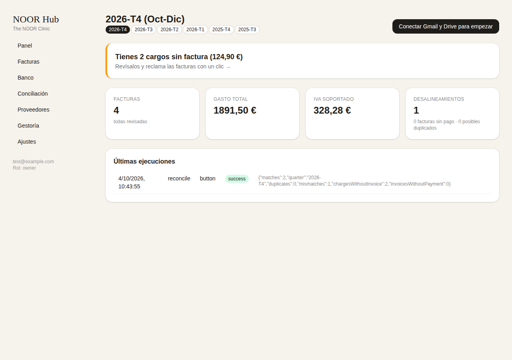
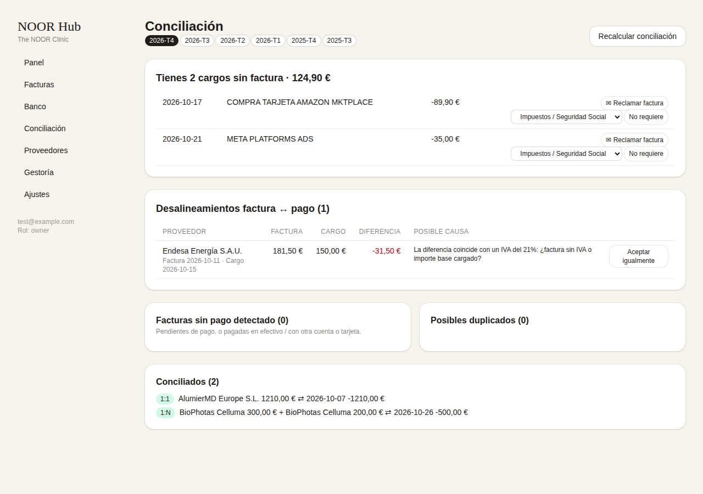
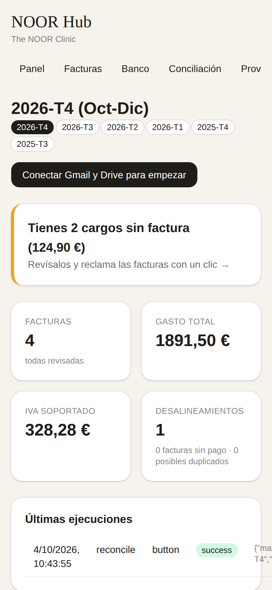

# NOOR Hub

App interna de **The NOOR Clinic** para automatizar las facturas de compra:

1. **Busca todas las facturas en Gmail** (adjuntos PDF/imagen/XML Facturae), las lee con IA y extrae proveedor, NIF, nº, fechas, base, IVA, retención, total y líneas.
2. **Las archiva en Google Drive por trimestres** con nombre normalizado, y genera el *Libro registro de facturas recibidas* (Excel) de cada trimestre.
3. **Registra gastos y conceptos** en una base de datos (y en el Excel) y da de alta proveedores automáticamente.
4. **Lee el banco** (PSD2, solo lectura; o importando el extracto Norma 43/CSV) y **concilia**: *"Tienes X cargos sin factura"*, desalineamientos de importe, facturas sin pago, pagos agrupados/fraccionados y duplicados.
5. **Reclama facturas** con un clic (crea un borrador en Gmail al proveedor).
6. **Fase 2 (ya construida, desactivada):** envío trimestral a la gestoría con resumen de IVA, Excel adjunto y carpeta de Drive compartida.

Todo esto con **un botón** ("Buscar facturas y conciliar") y además **automático cada día** (cron).

| Panel | Conciliación | iPhone |
|---|---|---|
|  |  |  |

*(capturas con datos de demostración)*

Documentación:
- [Arquitectura](docs/ARQUITECTURA.md)
- [Seguridad y protección de datos (RGPD)](docs/SEGURIDAD-RGPD.md)
- [Hoja de ruta y propuesta de automatización ampliada](docs/ROADMAP.md)

---

## Puesta en marcha (paso a paso)

Necesitas: un Mac con [Node.js 22+](https://nodejs.org) y (para local) Docker Desktop. Tiempo estimado: ~1 h la primera vez.

### 1. Google Cloud (Gmail + Drive + login)
1. Entra en <https://console.cloud.google.com> con **acostamedicalconsulting@gmail.com** y crea el proyecto `noor-hub`.
2. *APIs y servicios → Biblioteca*: habilita **Gmail API** y **Google Drive API**.
3. *Pantalla de consentimiento OAuth*: tipo **Externo**, nombre "NOOR Hub", añade tu email como usuario de prueba.
   Scopes: `gmail.readonly`, `gmail.compose`, `drive.file`, `openid`, `email`.
4. **Importante:** cuando funcione, pulsa **"Publicar aplicación"** (estado *En producción*). En modo *Prueba* Google caduca el acceso cada 7 días. Al ser de uso interno (<100 usuarios) no necesitas la verificación de Google: solo verás un aviso "Google no ha verificado esta app" → *Avanzado → Continuar*.
5. *Credenciales → Crear ID de cliente OAuth → Aplicación web*. URIs de redirección:
   - `http://localhost:3000/api/auth/callback/google`
   - `http://localhost:3000/api/integrations/google/callback`
   - (y las mismas con tu dominio de producción)
6. Copia *Client ID* y *Client secret* a `.env`.

### 2. Claude API (lectura de facturas)
Crea una clave en <https://console.anthropic.com> → `ANTHROPIC_API_KEY`. Coste orientativo: céntimos por factura.

### 3. Banco (opcional pero recomendado)
- **Automático (PSD2):** crea una cuenta en [Enable Banking](https://enablebanking.com), registra una aplicación con redirect `…/api/integrations/bank/callback`, descarga la clave privada → `ENABLEBANKING_APP_ID` y `ENABLEBANKING_PRIVATE_KEY`. (GoCardless/Nordigen ya no admite altas nuevas desde 2025).
- **Manual:** sin configurar nada, en *Banco → Importar extracto* sube el fichero **Norma 43** que descargas de tu banca online.

### 4. Arrancar en local
```bash
cd noor-hub
cp .env.example .env        # y rellena los valores
docker compose up -d        # Postgres local
npm install
npm run db:migrate
npm run dev                 # http://localhost:3000
```
Entra con Google → crea la clínica → *Ajustes → Conectar Google* (con el buzón de compras) → *Panel → Buscar facturas y conciliar*.

¿Quieres verla antes con datos ficticios? `npm run seed -- tu-email@gmail.com`.

### 5. Producción (recomendado)
- **Vercel** (región Frankfurt `fra1`, ya configurado en `vercel.json`) + **Neon** o **Supabase** Postgres en `eu-central-1`.
- Copia las variables de `.env` al proyecto de Vercel (con `APP_URL` = tu dominio).
- `vercel.json` programa la sincronización diaria a las 06:00 UTC.
- En el iPhone: abre la web en Safari → *Compartir → Añadir a pantalla de inicio* (funciona como app).

## Comandos
| | |
|---|---|
| `npm run dev` | servidor de desarrollo |
| `npm test` | tests (conciliación, parsers banco, cifrado, trimestres…) |
| `npm run lint` | comprobación de tipos |
| `npm run db:generate` / `db:migrate` | migraciones de BD |
| `npm run sync` | sincronización completa desde la terminal |
| `npm run seed -- email` | datos de demostración |
